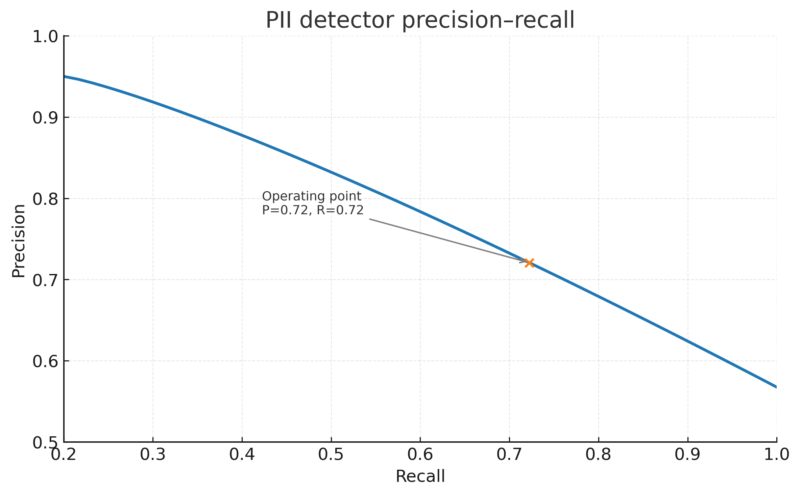

# Digital Compliance Framework

**Automated PII detection and compliance analytics for social media operations.**

## Table of contents
- [Overview](#overview)
- [Business context](#business-context)
- [Methodology](#methodology)
- [Key results and insights](#key-results-and-insights)
- [Recommendations](#recommendations)
- [Data dictionary](#data-dictionary)
- [How to view the dashboard](#how-to-view-the-dashboard)

## Overview
This repository analyzes digital communications to identify and mitigate compliance risks, including PII exposure and engagement disparities across platforms. It includes synthetic but internally consistent data, Python analysis, and static dashboards.

## Business context
Social teams need visibility into risk signals (PII leakage, content policy violations) and the operational tradeoffs between compliance and engagement.

## Methodology
Regex-based detection for phone, email, and SSN patterns; platform-level aggregation; precision–recall analysis to select an operating point; and high-resolution Matplotlib visuals aligned with a consistent design system.

## Key results and insights

### Engagement rate trajectory (%)

### Platform performance comparison (scaled)

### PII type breakdown by platform

### PII detector precision–recall

## Recommendations
- Enforce automated PII checks pre-publish; review escalations daily.
- Operate at a threshold that balances recall (risk coverage) with precision (analyst workload).
- Track platform-level flag composition to target creator guidance and templates.

## Data dictionary
- **comments.csv** — synthetic platform comments: comment_id, platform, comment_text, engagement_rate
- **comments_flagged.csv** — same plus `pii_types` list per row, derived via regex

## How to view the dashboard
To view the dashboard live, enable GitHub Pages under **Settings → Pages → main branch / (root)**.
